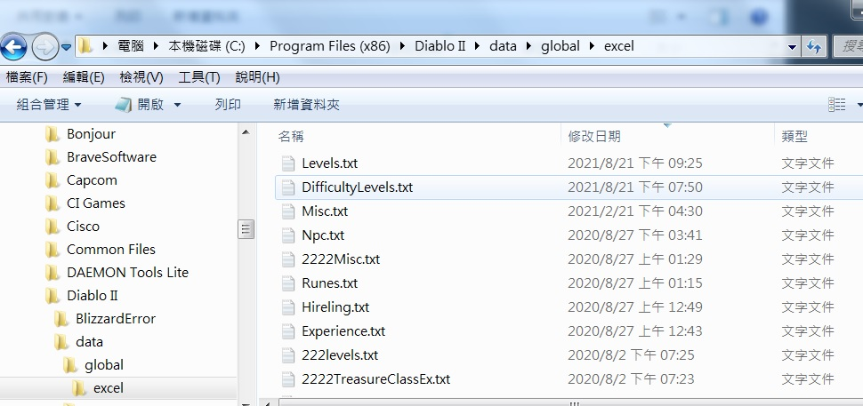

# Diablo2_Jacky_Mod (單機 mod)

**不改任何**怪物、角色技能、武器強度，增加怪物數量（4 到 10 倍）。  

自己好玩的版本，沒有打算繼續開發，歡迎自己 fork 改你想要玩的版本。  
- (但如果你知道怎麼簡單改出無限牛關、紅門、地表的話，可以開 issue 跟我說，我有興趣加上。)  
- (之前寫的修改參考文件 -> https://github.com/flameddd/blog/blob/master/2020-05-30%EF%BC%9ADiablo2%20%E6%9A%97%E9%BB%91%E7%A0%B4%E5%A3%9E%E7%A5%9E2:%20%E4%BF%AE%E6%94%B9%E5%96%AE%E6%A9%9F%E6%80%AA%E7%89%A9%E6%95%B8%E9%87%8F%E3%80%81%E7%89%A9%E5%93%81%E6%8E%89%E8%90%BD%E6%A9%9F%E7%8E%87.md )

## 特點
- **不改任何**怪物、角色技能、武器強度
- 增加怪物數量（4 ~ 10 倍）（地獄數量最多）
  - 怪物不掉落 gold
  - 怪物盡量掉落紫水
    - 一來掉落物品多，紅、藍很亂，反而影響遊戲體驗
    - 二來後期應該也有需要，所以直接選掉大紫
  - 基本上我沒有去改物品掉落機率，不過前面兩點多少會影響機率，大概感受不出來有差。  
- 升級所需經驗值 1/10
- 天梯符文組、武器
- 商人賣符紋、完美寶石
  - A1 **阿卡拉**
  - A2 **法拉**
  - A3 **奧瑪斯**
  - A4 **賈梅拉**
  - A5 **拉蘇克**
- 賭博戒指、項鍊 1 元
- 調整賭博機率，更容易出現黃裝、金裝、綠裝（除了符文，基本裝都用睹的比較快）
- 地獄暗黑會掉「一個」毀符和「一個」火炬 (其他都普通護符)
- 商人百倍價格收購物品
  - 沒錢就去買東西、然後賣掉
    - 按住 `shift` 買 12 隻 key (買好幾組)，然後賣掉
  - 有幾萬塊後，去賭博，然後賣掉(最快)

## 平衡性
- 沒有甚麼平衡性測試，但所有角色我都破過一遍了 (幾隻角色用謎團硬衝到後面的)
- 陷阱刺 >>>>> 法師 > 死靈 >>> 祝槌丁 > 弓馬 > 標馬(泰坦難打) > 野蠻 = 德
  - (簡單 -> 難)

## 角色建議
- 因為怪物變很多，所以一定需要範圍招式。**只練單體招，估計會玩不下去...**

## 可能的問題
- 如果遇到**傳點無法啟動**，那就先卷軸回城，再回來就能成功啟動傳點
  - (目前猜測是地圖上怪物、物品等物件太多造成的)

## 使用前
- 先備份自己單機角色檔案

## 使用方法
1. download 這個 repo (右上方**綠色clone** -> **Download Zip**)
2. 把 `data/global/excel/` 裡面的所有檔案，放到 `\Diablo II\data\global\excel` 位置去
    - e.x. `\Diablo II\data\global\excel\levels.txt`
    - 沒有 data, global, excel 資料夾的話，自己建立就好
3. 把「暗黑的執行檔」傳送到「桌面建立捷徑」
    - 到桌面上的捷徑按右鍵 → 內容 → **目標**
    - 空一格後輸入 ` -direct -txt`
    - e.x. `"C:\Program Files (x86)\Diablo II\Diablo II.exe" -w -direct -txt`
    - （如果你以前有設定過，發現無法生效的話，就移除「`-direct -txt`」，套用，然後再加回去一次）

## 懶得自己重練，就下載人家準備好的角色存檔吧
- 易牙居各種職業、各種 build 單機角色存檔 http://iyazero.tw/download.htm
  - (易牙居首頁 http://iyazero.tw/Default.htm )

## screenshots
  
  
  
  
  
   

